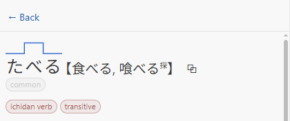

# 📔 Jisho: Offline Japanese Dictionary for VS Code

[![CI status][ci_badge]][ci]

An offline Japanese dictionary in your sidebar. Look up a word, read a kanji, or check a
conjugation without leaving your editor.

<picture>
  <source media="(prefers-color-scheme: dark)" srcset="docs/images/overview-dark.png" />
  
</picture>

---

Contents

- [What Jisho is](#what-jisho-is)
- [Install](#install)
- [Get started](#get-started)
- [Searching](#searching)
- [Reading a word](#reading-a-word)
- [Kanji](#kanji)
- [Finding a character you cannot type](#finding-a-character-you-cannot-type)
- [Browsing](#browsing)
- [Working in the editor](#working-in-the-editor)
- [Commands](#commands)
- [Settings](#settings)
- [Troubleshooting](#troubleshooting)
- [FAQ](#faq)
- [Data sources](#data-sources)
- [Contributing](#contributing)
- [License](#license)

## What Jisho is

Jisho is a Japanese-English dictionary that runs entirely on your machine. It is built for reading:
you are in a file with Japanese in it, you meet a word you do not know, and you want the answer
without opening a browser.

Every lookup runs against a local database. There is no network request, no account, and no rate
limit. It is modelled on [Shirabe Jisho][shirabe], a macOS and iOS dictionary.

The dictionary covers about 218,000 words and 10,000 kanji, drawn from [JMdict and
KANJIDIC][jmdict], the same data behind most open Japanese dictionaries. See
[Data sources](#data-sources) for the full list.

## Install

Install **Jisho: Offline Japanese Dictionary** from the Extensions view in VS Code, or from the
[Marketplace][marketplace].

Jisho requires **VS Code 1.123 or newer**.

The first time you open the panel, Jisho downloads its dictionary. That is about 125 MB, which
expands to around 450 MB on disk, and a progress notification tracks it. This happens once. After
that, everything is local.

## Get started

This walkthrough covers one lookup, start to finish.

1. **Open the panel.** Run **View: Show Jisho** from the Command Palette
   (<kbd>Ctrl</kbd>+<kbd>Shift</kbd>+<kbd>P</kbd>, or <kbd>Cmd</kbd>+<kbd>Shift</kbd>+<kbd>P</kbd>
   on macOS). Jisho also adds an icon to the activity bar down the side of the window, though with
   several extensions installed VS Code may fold it into the **…** overflow menu at the bottom.

   <picture>
     <source media="(prefers-color-scheme: dark)" srcset="docs/images/search-toolbar-dark.png" />
     
   </picture>

2. **Type what you are looking for.** Japanese, romaji, or English all work. The screenshot above
   shows `toshokan` finding 図書館.

3. **Select a result** to open its page. Every entry gives you readings, meanings grouped by part
   of speech, and example sentences.

   <picture>
     <source media="(prefers-color-scheme: dark)" srcset="docs/images/word-page-dark.png" />
     
   </picture>

4. **Select any Japanese word in an example** to jump to its entry. Use **← Back** to return.

That is the whole loop: search, read, follow a link, go back.

## Searching

The search field takes four kinds of input, and you do not have to tell it which you are using.

| You type       | Example      | You get                          |
| -------------- | ------------ | -------------------------------- |
| Japanese       | `図書館`     | The word itself                  |
| Kana           | `としょかん` | Words with that reading          |
| Hepburn romaji | `toshokan`   | The same, transliterated for you |
| English        | `library`    | Words meaning that               |

Results are ranked by relevance, so the word you probably meant comes first.

### Conjugated words

Type a word as it appears in your text. Jisho works back to the dictionary form: 食べました finds
食べる, 読まなかった finds 読む.

### Whole sentences

Paste a sentence and Jisho breaks it into words, each labelled with its part of speech. Select any
one of them to search it on its own.

<picture>
  <source media="(prefers-color-scheme: dark)" srcset="docs/images/sentence-breakdown-dark.png" />
  
</picture>

The bar separates the sentence's **full match** from its **partial matches**, so a phrase that is
itself an entry does not get buried under its own components.

### Names

Personal and place names come from a separate database, so a name in your text resolves instead of
returning nothing. The names database downloads the first time you need it.

## Reading a word

A word's page is arranged so the answer you most likely want is at the top.

<picture>
  <source media="(prefers-color-scheme: dark)" srcset="docs/images/word-headword-dark.png" />
  
</picture>

The line above the reading is its **pitch accent**: where the pitch drops, which is the part of
Japanese pronunciation that dictionaries usually leave to a number.

Tags mark what the word is and how common it is. Select a tag to see every other word that carries
it.

Beside each reading are two buttons. The 🔊 button speaks the reading aloud, and appears only when
your system has a Japanese voice installed. The copy button is covered under
[Copying](#copying) below.

### Example sentences

A few examples sit inline under each meaning. Select **more examples** for the full pool.

<picture>
  <source media="(prefers-color-scheme: dark)" srcset="docs/images/more-examples-dark.png" />
  
</picture>

Every sentence has furigana over its kanji, and every word in it is a link to its own entry.

### Copying

Select the copy button beside a reading to copy the word in whichever form you need.

<picture>
  <source media="(prefers-color-scheme: dark)" srcset="docs/images/copy-as-menu-dark.png" />
  
</picture>

Each option previews what you will get, including the two furigana markups, Markdown ruby
(`{食|た}べる`) and HTML (`<ruby>食<rt>た</rt></ruby>べる`). Markdown ruby needs a renderer that
understands it; see [Add furigana to a selection](#add-furigana-to-a-selection).

### Conjugations

Below the entry's meanings, verbs and adjectives get a full conjugation table.

<picture>
  <source media="(prefers-color-scheme: dark)" srcset="docs/images/conjugations-dark.png" />
  
</picture>

The same view carries two sections above the table. **Info** holds the word's JLPT level and a
WaniKani link where there is one, and **Kanji** lists the characters the word is written with, each
opening its own page.

Select a form's name in the table to read what it does and when to use it.

## Kanji

Kanji are results in their own right, not only parts of words. A search that matches a character
lists it in its own **Kanji** section, below the words.

<picture>
  <source media="(prefers-color-scheme: dark)" srcset="docs/images/search-results-dark.png" />
  
</picture>

Selecting a character opens a page for the character itself.

<picture>
  <source media="(prefers-color-scheme: dark)" srcset="docs/images/kanji-page-dark.png" />
  
</picture>

A kanji page carries its meanings and readings, how many strokes it takes, what grade it is taught
in, the components it is built from, and the characters that look like it.

### Stroke order

Every kanji and every kana has an animated stroke-order diagram.

<picture>
  <source media="(prefers-color-scheme: dark)" srcset="docs/images/stroke-order-dark.png" />
  
</picture>

Drag the scrubber to move through the strokes one at a time. The numbered marker shows where each
stroke begins and the dashed arrow shows which way it goes.

## Finding a character you cannot type

Two ways in, for when you can see a character but have no way to enter it.

### By its radicals

Select the **部** button beside the search field, then pick components you can see in the character.
Radicals that cannot appear alongside your selection grey out as you go.

<picture>
  <source media="(prefers-color-scheme: dark)" srcset="docs/images/radical-picker-dark.png" />
  
</picture>

### By drawing it

Select the pencil button and draw the character. Stroke order and stroke count do not matter, and
you do not have to finish.

<picture>
  <source media="(prefers-color-scheme: dark)" srcset="docs/images/handwriting-dark.png" />
  
</picture>

Candidates update after every stroke. Select one to add it to your search.

## Browsing

The four buttons along the bottom of the panel switch between searching and browsing.

<picture>
  <source media="(prefers-color-scheme: dark)" srcset="docs/images/browse-vocab-dark.png" />
  
</picture>

- **Vocab**: by JLPT level, how common a word is, language part, usage, subject, or dialect.
- **Kanji**: by JLPT level, school grade, or frequency.
- **Kana**: the gojūon chart.

Selecting a category opens its groups.

<picture>
  <source media="(prefers-color-scheme: dark)" srcset="docs/images/browse-categories-dark.png" />
  
</picture>

Selecting a group opens its word list.

<picture>
  <source media="(prefers-color-scheme: dark)" srcset="docs/images/browse-word-list-dark.png" />
  
</picture>

Lists sort by frequency or in gojūon order. In gojūon order, the rail down the side jumps you to a
kana.

Kanji browse as a grid instead, each character with its meaning.

<picture>
  <source media="(prefers-color-scheme: dark)" srcset="docs/images/kanji-browse-list-dark.png" />
  
</picture>

The **Kana** tab is a chart of hiragana and katakana. Selecting a kana opens its stroke order,
because these are single syllables rather than words and there is nothing to look up.

<picture>
  <source media="(prefers-color-scheme: dark)" srcset="docs/images/kana-chart-dark.png" />
  
</picture>

## Working in the editor

Jisho also works on the file you have open. These features apply to **Markdown and plain-text
files**.

### Hover for a definition

Point at a Japanese word to see what it means.

<picture>
  <source media="(prefers-color-scheme: dark)" srcset="docs/images/editor-hover-dark.png" />
  
</picture>

The card gives you the reading, the meaning, and, for a conjugated word, how it was formed.
**Open in Jisho** takes you to the full entry.

To turn hovers off, set `vscode-jisho.hover.enabled` to `false`.

### Color Japanese by part of speech

Japanese does not put spaces between words. Turning on part-of-speech coloring gives you the word
boundaries, with verbs, nouns, particles and auxiliaries each in their own color.

<picture>
  <source media="(prefers-color-scheme: dark)" srcset="docs/images/pos-highlighting-dark.png" />
  
</picture>

This is off by default. Turn it on with `vscode-jisho.highlighting.enabled`.

Three alternative palettes are available for protanopia, deuteranopia and tritanopia. They are not
tinted versions of the standard palette. Each one re-picks its colors to stay distinguishable. Set
`vscode-jisho.appearance.palette` to choose one.

### Add furigana to a selection

Furigana are the small kana printed above kanji to give their reading.

<picture>
  <source media="(prefers-color-scheme: dark)" srcset="docs/images/add-furigana-dark.png" />
  
</picture>

Select some text and run **Jisho: Add Furigana (ふりがな)**. **Jisho: Remove Furigana** undoes it.

The markup is `{漢字|かんじ}`: the word, a pipe, then its reading. Markdown has no ruby syntax of
its own, so a plain renderer prints those braces literally. To see them as furigana instead, add a
ruby plugin wherever your Markdown is rendered:

| Where                      | Add                                                       |
| -------------------------- | --------------------------------------------------------- |
| VS Code's Markdown preview | [Markdown DenDen Furigana][denden-furigana], an extension |
| markdown-it                | [`@mirrordown/mdit-ruby`][mdit-ruby]                      |
| remark, unified, MDX       | [`@mirrordown/remd-ruby`][remd-ruby]                      |

All three come from [Mirrordown][mirrordown], a suite of Markdown syntax extensions for the
markdown-it and unified ecosystems. The VS Code extension is `@mirrordown/mdit-ruby` wired into the
built-in preview, so what you see there matches what your site build produces.

## Commands

Run these from the Command Palette, or from the **Jisho** submenu in the editor's right-click menu.
Those that act on text need a selection first.

| Command                                  | What it does                                    |
| ---------------------------------------- | ----------------------------------------------- |
| **Jisho: Look Up Selection**             | Searches the selected text in the panel         |
| **Jisho: Speak Selection**               | Reads the selected Japanese aloud               |
| **Jisho: Add Furigana (ふりがな)**       | Adds readings above the kanji, as Markdown ruby |
| **Jisho: Remove Furigana**               | Strips that markup back out                     |
| **Jisho: Add Word Spacing (分かち書き)** | Puts spaces between words                       |
| **Jisho: Remove Word Spacing**           | Takes them back out                             |
| **Jisho: Open Settings**                 | Opens Jisho's settings                          |
| **Jisho: Check for Dictionary Updates**  | Checks for newer dictionary data                |

## Settings

Reach these through **Jisho: Open Settings**, or the gear button in the panel.

| Setting                                 | Default    | What it controls                                                      |
| --------------------------------------- | ---------- | --------------------------------------------------------------------- |
| `vscode-jisho.hover.enabled`            | `true`     | Dictionary hovers over Japanese in Markdown and plain-text files      |
| `vscode-jisho.highlighting.enabled`     | `false`    | Part-of-speech coloring in those same files                           |
| `vscode-jisho.grammar.enabled`          | `true`     | Grammar explanations in hovers and the conjugation table              |
| `vscode-jisho.appearance.textScale`     | `1.08`     | Text size in the panel, as a multiplier over VS Code's font size      |
| `vscode-jisho.appearance.tagLabels`     | `english`  | Whether grammar tags read in English or Japanese                      |
| `vscode-jisho.appearance.colorExamples` | `true`     | Part-of-speech coloring inside the panel's example sentences          |
| `vscode-jisho.appearance.palette`       | `standard` | Which color palette to use, including three color-vision alternatives |
| `vscode-jisho.strokeOrder.guideStyle`   | `offset`   | Whether stroke guides trace the stroke or sit clear of it             |
| `vscode-jisho.dictionary.autoCheck`     | `true`     | Whether to check daily for newer dictionary data                      |

## Troubleshooting

### The panel is empty, or says the dictionary is unavailable

The dictionary downloads on first use. If that download failed, most often because of a dropped connection,
run **Jisho: Check for Dictionary Updates** to try again.

### Hovers do nothing in my code file

Hovers and part-of-speech coloring apply to Markdown and plain-text files only. Japanese in a
`.ts`, `.py` or `.go` file is not covered yet.

### A word is not found, or the wrong word comes back

Jisho works out the dictionary form from the word's shape, and casual or spoken Japanese is harder
to read than written prose. If a lookup lands somewhere unexpected, please
[open an issue][issues] with the text you searched.

### The panel's text is too small or too large

Set `vscode-jisho.appearance.textScale`. It multiplies VS Code's own font size, so `1.2` is 20%
larger.

## FAQ

**Does this need an internet connection?**
Only for the initial dictionary download and for update checks. Every lookup is local.

**How much disk space does it use?**
About 450 MB for the dictionary, plus another 400 MB if you use name lookups, which download
separately the first time you need them.

**Does it work in vscode.dev or GitHub Codespaces?**
Not yet. Jisho reads its dictionary from the filesystem, which the browser build does not have.

**Is my text sent anywhere?**
No. There is no telemetry and no network request during a lookup.

**Which Japanese does it cover?**
Modern Japanese, as JMdict records it. Classical Japanese is out of scope.

## Data sources

Jisho is built on open dictionary projects whose licences require attribution. Full notices are in
[THIRD_PARTY_NOTICES.md](./THIRD_PARTY_NOTICES.md), and the About view in the panel carries the same
credits.

- **[JMdict / EDICT][jmdict]** and **[JMnedict][jmnedict]**: dictionary and name data, © [EDRDG][edrdg], under the [EDRDG Licence][edrdg-license].
- **[KANJIDIC2][kanjidic]** and **[KRADFILE / RADKFILE][kradfile]**: kanji data and radical decompositions, © EDRDG.
- **[JLPT vocabulary levels][tanos-jlpt]**: © [Jonathan Waller][tanos-jlpt], under [CC BY-SA 4.0][cc-by-sa].
- **[Pitch accent][kanjium]**: © Uros O., under [CC BY-SA 4.0][cc-by-sa].
- **[Kanji confusion data][yencken]**: © [Lars Yencken][yencken], under [CC BY 3.0][cc-by-3].
- **[Example sentences][tatoeba]**: from [Tatoeba][tatoeba], under [CC BY 2.0 FR][cc-by-fr].
- **[AnimCJK][animcjk]**: stroke-order drawings, © FM&SH, under the [Arphic Public License][apl] (kanji) and [LGPL v3][lgpl] (kana).
- **[KanjiCanvas][kanjicanvas]** and **[perfect-freehand][perfect-freehand]**: handwriting recognition and drawing, MIT.

## Contributing

Building the extension, running its tests, and refreshing the dictionary data are covered in
[CONTRIBUTING.md](./CONTRIBUTING.md). Bug reports go to [GitHub Issues][issues].

## License

Extension source released under the [MIT license][license] © [Drake Costa][personal-website].
Bundled dictionary data remains under its respective upstream licences. See
[THIRD_PARTY_NOTICES.md](./THIRD_PARTY_NOTICES.md).

[ci_badge]: https://github.com/Saeris/vscode-jisho/actions/workflows/ci.yml/badge.svg
[ci]: https://github.com/Saeris/vscode-jisho/actions/workflows/ci.yml
[marketplace]: https://marketplace.visualstudio.com/items?itemName=Saeris.vscode-jisho
[mirrordown]: https://github.com/mirrordown/mirrordown
[denden-furigana]: https://marketplace.visualstudio.com/items?itemName=saeris.markdown-denden-furigana
[mdit-ruby]: https://github.com/mirrordown/mirrordown/tree/main/packages/mdit-ruby
[remd-ruby]: https://github.com/mirrordown/mirrordown/tree/main/packages/remd-ruby
[shirabe]: https://ricoapps.com/
[jmdict]: http://www.edrdg.org/jmdict/j_jmdict.html
[edrdg]: https://www.edrdg.org/
[edrdg-license]: https://www.edrdg.org/edrdg/licence.html
[kanjidic]: https://www.edrdg.org/wiki/index.php/KANJIDIC_Project
[kradfile]: https://www.edrdg.org/krad/kradinf.html
[tanos-jlpt]: https://www.tanos.co.uk/jlpt/
[kanjium]: https://github.com/mifunetoshiro/kanjium
[tatoeba]: https://tatoeba.org/
[yencken]: https://lars.yencken.org/datasets/kanji-confusion/
[cc-by-fr]: https://creativecommons.org/licenses/by/2.0/fr/deed.en
[cc-by-3]: https://creativecommons.org/licenses/by/3.0/
[jmnedict]: https://www.edrdg.org/enamdict/enamdict_doc.html
[animcjk]: https://github.com/parsimonhi/animCJK
[apl]: https://ftp.gnu.org/non-gnu/chinese-fonts-truetype/LICENSE
[lgpl]: https://www.gnu.org/licenses/lgpl-3.0.html
[kanjicanvas]: http://github.com/asdfjkl/kanjicanvas
[perfect-freehand]: https://github.com/steveruizok/perfect-freehand
[cc-by-sa]: https://creativecommons.org/licenses/by-sa/4.0/
[issues]: https://github.com/Saeris/vscode-jisho/issues
[license]: ./LICENSE.md
[personal-website]: https://saeris.gg
