

# 📔 Jisho: Offline Japanese Dictionary for VS Code

[![CI status][ci_badge]][ci]

An offline Japanese dictionary in your sidebar. Look up a word, read a kanji, or check a conjugation without leaving your editor.

<picture>
  <source media="(prefers-color-scheme: dark)" srcset="docs/images/overview-dark.png" />
  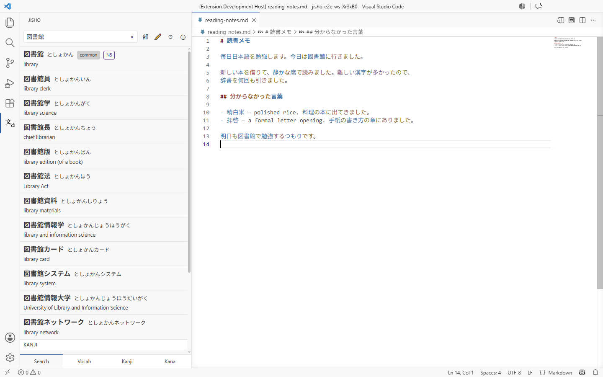
</picture>

---

Contents

- [📔 Jisho: Offline Japanese Dictionary for VS Code](#-jisho-offline-japanese-dictionary-for-vs-code)
  - [What Jisho is](#what-jisho-is)
  - [Install](#install)
  - [Getting Started](#getting-started)
  - [Searching](#searching)
    - [Conjugated words](#conjugated-words)
    - [Names](#names)
    - [Whole sentences](#whole-sentences)
  - [Reading a word](#reading-a-word)
    - [Example sentences](#example-sentences)
    - [Copying](#copying)
    - [Conjugations](#conjugations)
  - [Searching for Kanji](#searching-for-kanji)
    - [Stroke order](#stroke-order)
  - [Finding a character you cannot type](#finding-a-character-you-cannot-type)
    - [By its radicals](#by-its-radicals)
    - [By drawing it](#by-drawing-it)
  - [Browsing](#browsing)
    - [Vocabulary](#vocabulary)
    - [Kanji](#kanji)
    - [Kana](#kana)
  - [Working in the editor](#working-in-the-editor)
    - [Color Japanese by part of speech](#color-japanese-by-part-of-speech)
    - [Hover for a definition](#hover-for-a-definition)
    - [Add furigana to a selection](#add-furigana-to-a-selection)
  - [Commands](#commands)
  - [Settings](#settings)
  - [Troubleshooting](#troubleshooting)
    - [The panel is empty, or says the dictionary is unavailable](#the-panel-is-empty-or-says-the-dictionary-is-unavailable)
    - [Hovers do nothing in my code file](#hovers-do-nothing-in-my-code-file)
    - [A word is not found, or the wrong word comes back](#a-word-is-not-found-or-the-wrong-word-comes-back)
    - [The panel's text is too small or too large](#the-panels-text-is-too-small-or-too-large)
  - [FAQ](#faq)
  - [Data sources](#data-sources)
  - [Contributing](#contributing)
  - [License](#license)

## What Jisho is

Jisho is a Japanese-English dictionary that runs entirely on your machine. It is built for reading: you are in a file with Japanese in it, you meet a word you do not know, and you want the answer without opening a browser.

Every lookup runs against a local database. There is no network request, no account, and no rate limit. It is modelled on [Shirabe Jisho][shirabe], a macOS and iOS dictionary.

The dictionary covers about 218,000 words and 10,000 kanji, drawn from [JMdict and
KANJIDIC][jmdict], the same data behind most open Japanese dictionaries. See [Data sources](#data-sources) for the full list.

## Install

Install **Jisho: Offline Japanese Dictionary** from the Extensions view in VS Code, or from the [Marketplace][marketplace].

> [!Note]
>
> Jisho requires **VS Code 1.123 or newer**.

The first time you open the panel, Jisho downloads its dictionary. That is about 125 MB, which expands to around 450 MB on disk, and a progress notification tracks it. This happens once. After that, everything is local.

## Getting Started

<picture>
  <source media="(prefers-color-scheme: dark)" srcset="docs/images/search-results-dark.png" />
  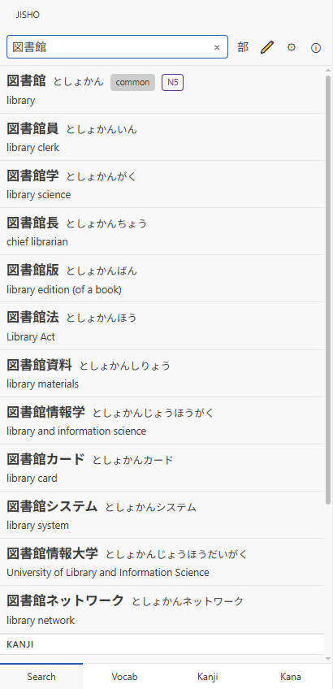
</picture>

This walkthrough covers one lookup, start to finish.

**1. Open the panel.** Run **View: Show Jisho** from the Command Palette
(<kbd>Ctrl</kbd>+<kbd>Shift</kbd>+<kbd>P</kbd>, or <kbd>Cmd</kbd>+<kbd>Shift</kbd>+<kbd>P</kbd> on macOS). Jisho also adds an icon to the activity bar, though with several extensions installed VS Code may fold it into the **…** overflow menu.

**2. Type what you are looking for.** Japanese, romaji, or English all work. Results are ranked by relevance, so the word you probably meant leads and its compounds follow.

**3. Select a result** to open its page. Every entry gives you its readings, meanings grouped by part of speech, and example sentences.

**4. Select any Japanese word in an example** to jump to its entry, and **← Back** to return.

That is the whole loop: search, read, follow a link, go back.

 

## Searching

<picture>
  <source media="(prefers-color-scheme: dark)" srcset="docs/images/search-toolbar-dark.png" />
  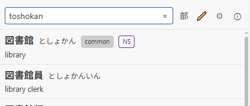
</picture>

The search field takes four kinds of input, and you do not have to tell it which you are using.

| You type       | Example      | You get                          |
| -------------- | ------------ | -------------------------------- |
| Japanese       | `図書館`     | The word itself                  |
| Kana           | `としょかん` | Words with that reading          |
| Hepburn romaji | `toshokan`   | The same, transliterated for you |
| English        | `library`    | Words meaning that               |

Results are ranked by relevance, so the word you probably meant comes first.

The four buttons beside the field are, in order: **部** for the radical picker, the pencil for handwriting, the gear for settings, and the ⓘ for the About page.

### Conjugated words

Type a word as it appears in your text. Jisho works back to the dictionary form: 食べました finds 食べる, 読まなかった finds 読む.

### Names

Personal and place names come from a separate database, so a name in your text resolves instead of returning nothing. The names database downloads the first time you need it.

<picture>
  <source media="(prefers-color-scheme: dark)" srcset="docs/images/sentence-breakdown-dark.png" />
  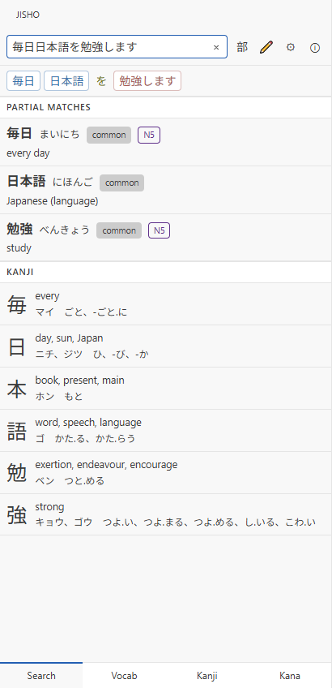
</picture>

### Whole sentences

Paste a sentence and Jisho breaks it into words, each labelled with its part of speech. Select any one of them to search it on its own.

Each word in the bar is colored by its part of speech, using the same palette as the editor highlighting, so the shape of the sentence is visible before you read any of it.

The bar separates the sentence's **full match** from its **partial matches**, so a phrase that is itself an entry does not get buried under its own components. Selecting a word narrows the results to that word alone.

 

## Reading a word

<picture>
  <source media="(prefers-color-scheme: dark)" srcset="docs/images/word-page-dark.png" />
  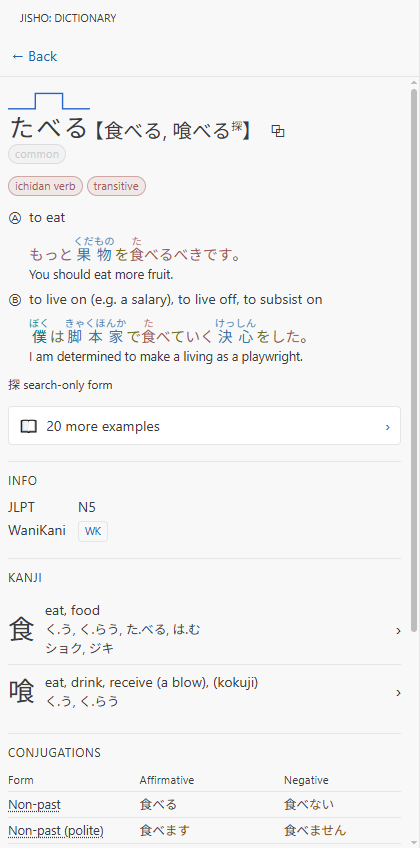
</picture>

A word's page is arranged so the answer you most likely want is at the top: the reading and its writings first, then the meanings, then everything you might want after that.

Meanings are numbered and grouped by part of speech, since a word that is both a noun and a verb is really two words sharing a spelling. Example sentences sit under the meaning they belong to.

The top of the entry carries the most information per line, so it is worth reading closely.

The line above the reading is its **pitch accent**: where the pitch drops, which is the part of Japanese pronunciation that dictionaries usually leave to a number.

Tags mark what the word is and how common it is. Select a tag to see every other word that carries it.

Beside each reading are two buttons. The 🔊 button speaks the reading aloud, and appears only when your system has a Japanese voice installed. The copy button is covered under [Copying](#copying) below.

  

<picture>
  <source media="(prefers-color-scheme: dark)" srcset="docs/images/more-examples-dark.png" />
  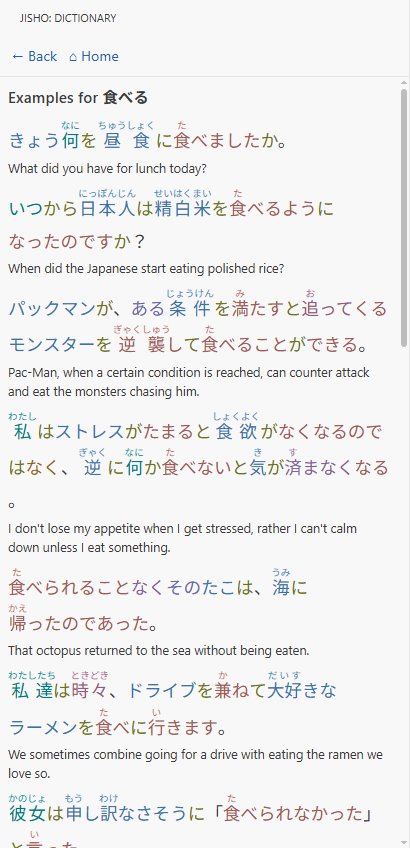
</picture>

### Example sentences

A few examples sit inline under each meaning. Select **more examples** for the full pool.

Every sentence has furigana over its kanji, so a word you cannot yet read is still pronounceable. Each is paired with an English translation.

Every Japanese word in a sentence is a link to its own entry, which makes the examples a way to read outward from a word rather than a list to skim. Following one and coming back with **← Back** is the loop the panel is built around.

  

<picture>
  <source media="(prefers-color-scheme: dark)" srcset="docs/images/copy-as-menu-dark.png" />
  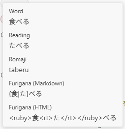
</picture>

### Copying

Select the copy button beside a reading to copy the word in whichever form you need.

Each option previews what you will get, including the two furigana markups, Markdown ruby (`{食|た}べる`) and HTML (`<ruby>食<rt>た</rt></ruby>べる`). Markdown ruby needs a renderer that understands it; see [Add furigana to a selection](#add-furigana-to-a-selection).

  

<picture>
  <source media="(prefers-color-scheme: dark)" srcset="docs/images/conjugations-dark.png" />
  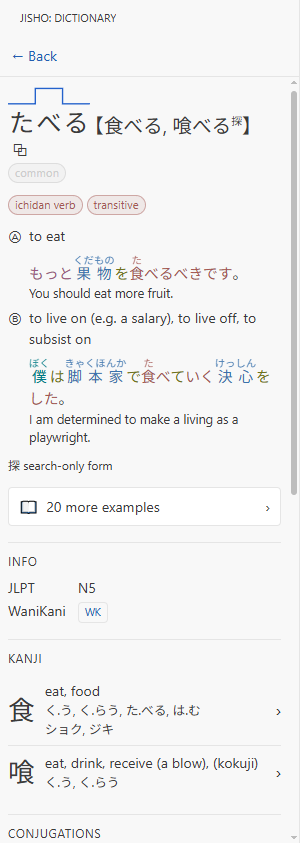
</picture>

### Conjugations

Below the entry's meanings, verbs and adjectives get a full conjugation table: non-past and past, plain and polite, te-form, potential, passive, causative, imperative, volitional, the two conditionals, and the desire form.

Select a form's name to read what it does and when to use it — which is the part a table alone does not tell you.

The same view carries two sections above the table. **Info** holds the word's JLPT level and a WaniKani link where there is one. **Kanji** lists the characters the word is written with, each opening its own page.

 

## Searching for Kanji

<picture>
  <source media="(prefers-color-scheme: dark)" srcset="docs/images/kanji-page-dark.png" />
  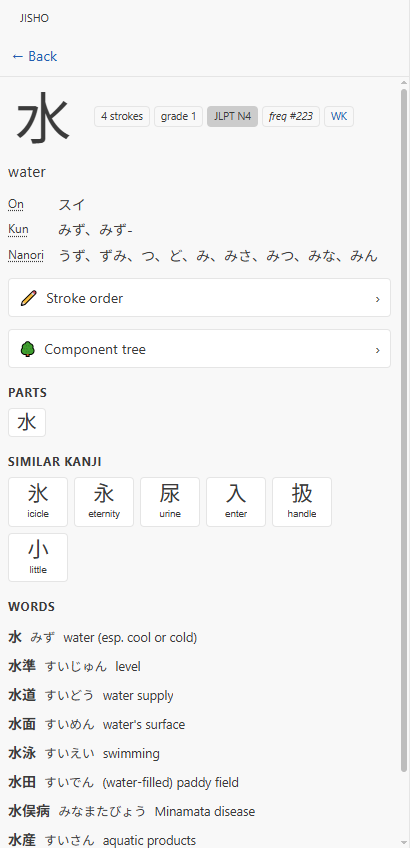
</picture>

Kanji are results in their own right, not only parts of words. A search that matches a character lists it in its own **Kanji** section, below the words.

Selecting a character opens a page for the character itself.

The badges along the top are the character's measurements: how many strokes it takes, the school grade it is taught in, its JLPT level, and how common it is in written Japanese.

Below them come the readings. **On** readings are borrowed from Chinese and usually appear in compounds; **kun** readings are native Japanese and usually stand alone. **Nanori** are the readings a character takes in names, which often match neither.

**Parts** lists the components the character is built from, each opening its own page. **Similar kanji** lists the ones most likely to be confused with it — characters that differ by a stroke or a single radical. **Words** lists vocabulary written with it, most common first.

  

<picture>
  <source media="(prefers-color-scheme: dark)" srcset="docs/images/stroke-order-dark.png" />
  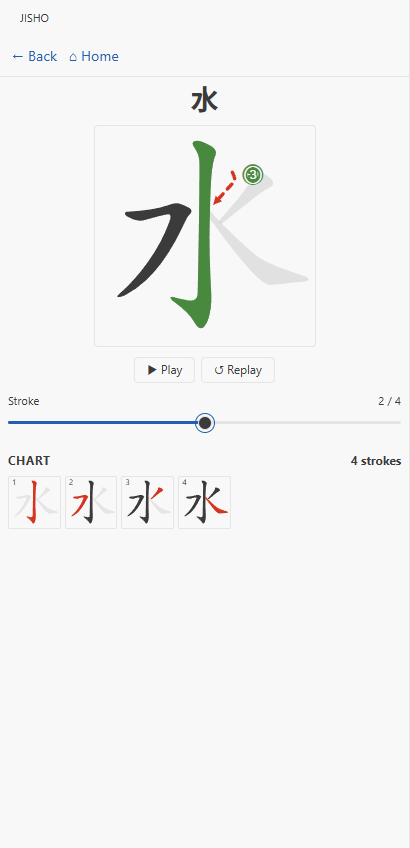
</picture>

### Stroke order

Every kanji and every kana has an animated stroke-order diagram.

Drag the scrubber to move through the strokes one at a time, or let it play. The numbered marker shows where each stroke begins and the dashed arrow shows which way it goes.

Below the player is a chart of the whole character, one frame per stroke, for when you want to see the order at a glance rather than watch it.

 

## Finding a character you cannot type

Two ways in, for when you can see a character but have no way to enter it.

<picture>
  <source media="(prefers-color-scheme: dark)" srcset="docs/images/radical-picker-dark.png" />
  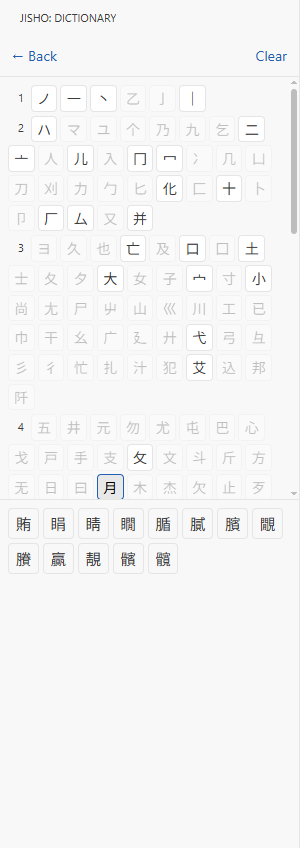
</picture>

### By its radicals

Select the **部** button beside the search field, then pick components you can see in the character. Radicals are grouped by how many strokes they take, so a component you can count is quick to find.

As you select, radicals that cannot appear alongside your choices grey out. A combination that would match nothing is never offered, so you can keep adding components until the list is short enough to
scan.

Matches appear underneath, each tile showing the character with a short meaning. Selecting one opens its kanji page.

  

<picture>
  <source media="(prefers-color-scheme: dark)" srcset="docs/images/handwriting-dark.png" />
  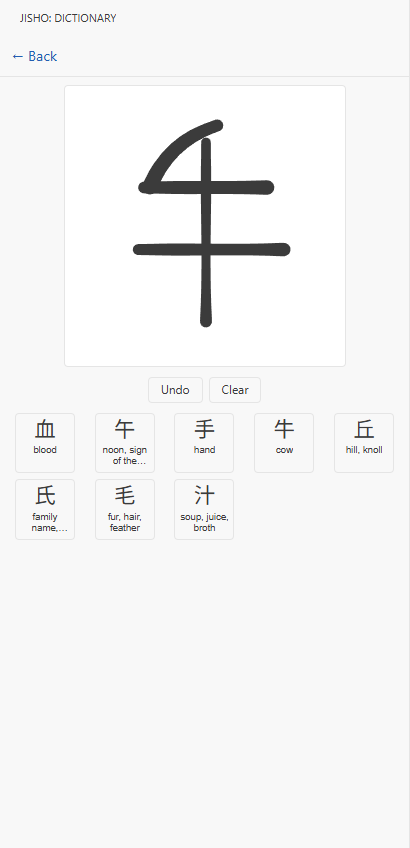
</picture>

### By drawing it

Select the pencil button and draw the character. Stroke order and stroke count do not matter, and you do not have to finish — the screenshot shows four strokes of a character that takes six.

Candidates update after every stroke, each labelled with its meaning so a near-miss is easy to spot. Drawing part of 年 turns up 牛, 午 and 手 alongside it, which is the point: you do not have to know a character to find it, only to see it.

Select one to add it to your search.

 

## Browsing

  
    <picture>
      <source media="(prefers-color-scheme: dark)" srcset="docs/images/browse-vocab-dark.png" />
      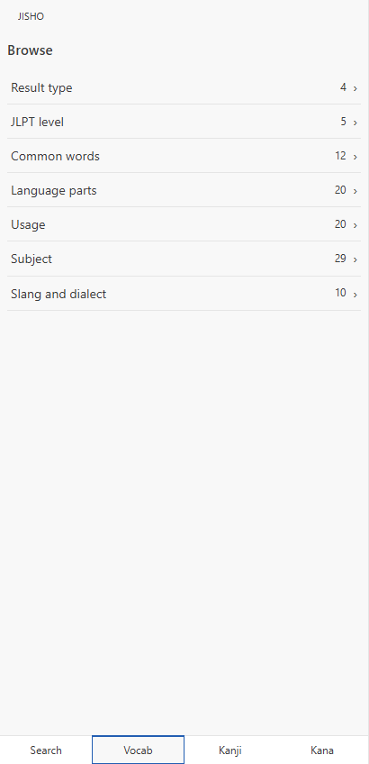
    </picture>
  
  
    <picture>
      <source media="(prefers-color-scheme: dark)" srcset="docs/images/browse-categories-dark.png" />
      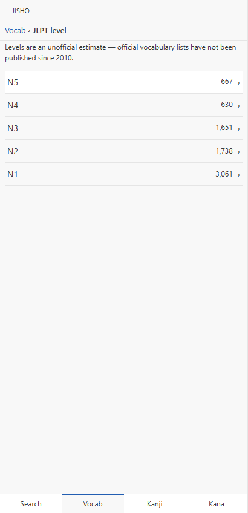
    </picture>
  
  
    <picture>
      <source media="(prefers-color-scheme: dark)" srcset="docs/images/browse-word-list-dark.png" />
      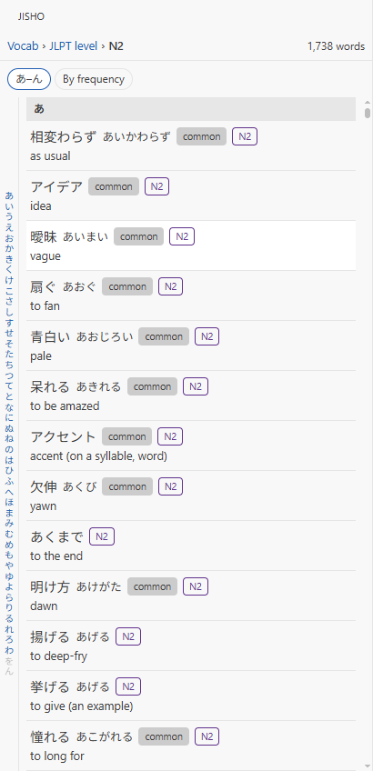
    </picture>
  

The four buttons along the bottom of the panel switch between searching and browsing.

- **Vocab**: by JLPT level, how common a word is, language part, usage, subject, or dialect.
- **Kanji**: by JLPT level, school grade, or frequency.
- **Kana**: the gojūon chart.

Browsing is two steps, shown above from left to right: a category opens its groups, and a group opens its list. The counts beside each row are live, so a category tells you how much is behind it before you commit to opening it.

The breadcrumb across the top tracks where you are, and every step in it is a link back.

### Vocabulary

Vocabulary lists open in gojūon order (**あ–ん**), which is the order kana are taught and the one to reach for when you know roughly how a word sounds. The rail down the side jumps you to a kana, so a 1,700-word list stays navigable. Switch to **By frequency** for the most common words first.

Selecting an entry will open that word's page.

<picture>
  <source media="(prefers-color-scheme: dark)" srcset="docs/images/kanji-browse-list-dark.png" />
  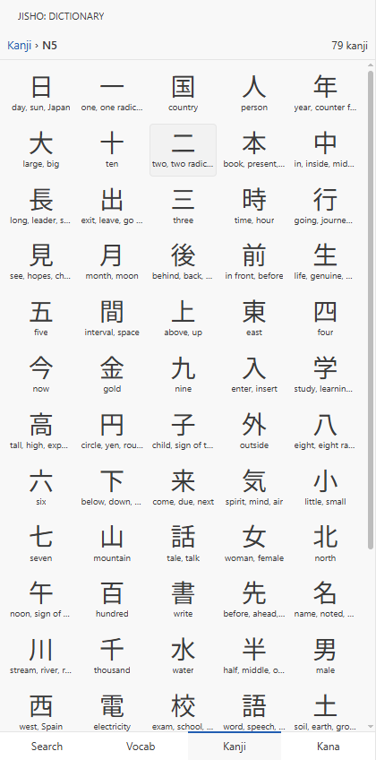
</picture>

### Kanji

Kanji browse as a grid instead, each character with its meaning.

The grid fits far more on screen than a list would, which suits browsing a level or a school grade where you are looking for what you do not recognise rather than for one particular character.

Each tile carries a short meaning under the character, so the set is scannable without opening anything.

Selecting a tile opens that character's page.

  

<picture>
  <source media="(prefers-color-scheme: dark)" srcset="docs/images/kana-chart-dark.png" />
  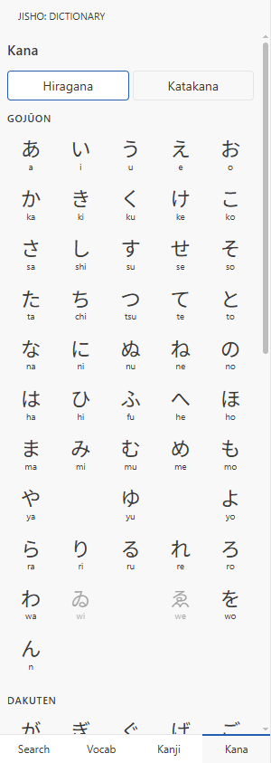
</picture>

### Kana

The **Kana** tab is a chart of hiragana and katakana.

The chart is laid out in gojūon order — rows by consonant, columns by vowel — which is the order kana are taught and the order every list in the panel sorts by.

Selecting a kana opens its stroke order rather than searching: a single syllable is not a word, so there is nothing to look up. Obsolete kana (ゐ, ゑ) are dimmed rather than hidden, since they still turn up in older text.

 

## Working in the editor

Jisho also works on the file you have open. These features apply to **Markdown and plain-text files**.

### Color Japanese by part of speech

  <figure>
    <picture>
      <source media="(prefers-color-scheme: dark)" srcset="docs/images/pos-highlighting-dark.png" />
      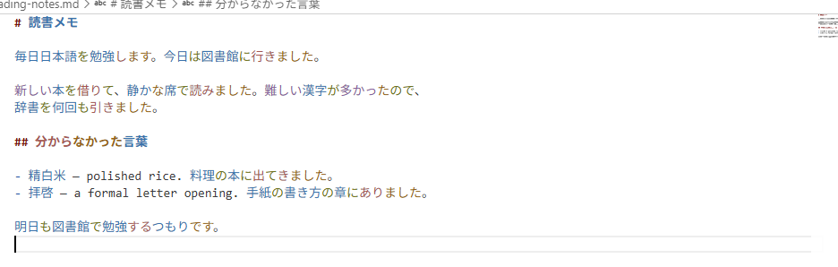
    </picture>
    <figcaption><small><em>Jisho provides parts of speech "syntax highlighting" to aid in reading Japanese text.</em></small></figcaption>
  </figure>

Japanese does not put spaces between words. Turning on part-of-speech coloring gives you the word boundaries, with verbs, nouns, particles and auxiliaries each in their own color.

This is off by default. Turn it on with `vscode-jisho.highlighting.enabled`.

Three alternative palettes are available for protanopia, deuteranopia and tritanopia. They are not tinted versions of the standard palette. Each one re-picks its colors to stay distinguishable. Set `vscode-jisho.appearance.palette` to choose one.

### Hover for a definition

  <figure>
    <picture>
      <source media="(prefers-color-scheme: dark)" srcset="docs/images/editor-hover-dark.png" />
      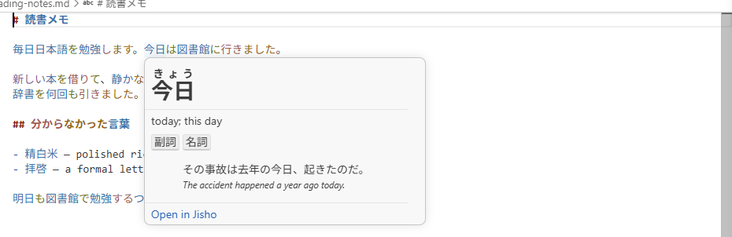
    </picture>
    <figcaption><small><em>Point at a Japanese word to see what it means.</em></small></figcaption>
  </figure>

Hover cards give you the reading, the meaning, and, for a conjugated word, how it was formed. **Open in Jisho** takes you to the full entry.

To turn hovers off, set `vscode-jisho.hover.enabled` to `false`.

### Add furigana to a selection

  <figure>
    <picture>
      <source media="(prefers-color-scheme: dark)" srcset="docs/images/add-furigana-dark.png" />
      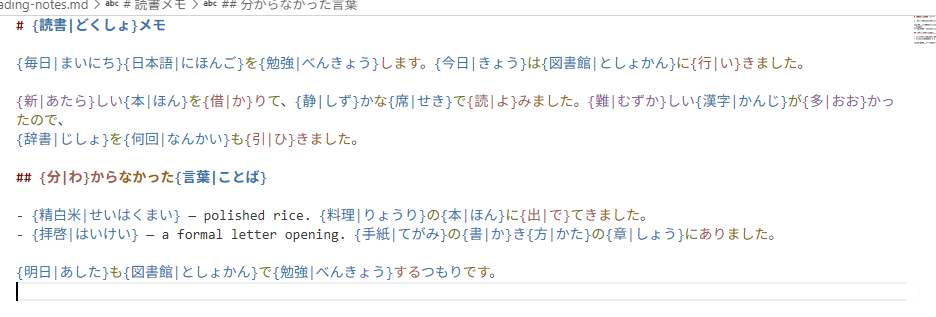
    </picture>
    <figcaption><small><em>Furigana are the small kana printed above kanji to give their reading.</em></small></figcaption>
  </figure>

Select some text and run **Jisho: Add Furigana (ふりがな)**. **Jisho: Remove Furigana** undoes it.

The markup is `{漢字|かんじ}`: the word, a pipe, then its reading. Markdown has no ruby syntax of its own, so a plain renderer prints those braces literally. To see them as furigana instead, add a ruby plugin wherever your Markdown is rendered:

| Where                      | Add                                                       |
| -------------------------- | --------------------------------------------------------- |
| VS Code's Markdown preview | [Markdown DenDen Furigana][denden-furigana], an extension |
| markdown-it                | [`@mirrordown/mdit-ruby`][mdit-ruby]                      |
| remark, unified, MDX       | [`@mirrordown/remd-ruby`][remd-ruby]                      |

All three come from [Mirrordown][mirrordown], a suite of Markdown syntax extensions for the markdown-it and unified ecosystems. The VS Code extension is `@mirrordown/mdit-ruby` wired into the built-in preview, so what you see there matches what your site build produces.

## Commands

Run these from the Command Palette, or from the **Jisho** submenu in the editor's right-click menu. Those that act on text need a selection first.

| Command                                        | What it does                                    |
| ---------------------------------------------- | ----------------------------------------------- |
| **Jisho: Look Up Selection**                   | Searches the selected text in the panel         |
| **Jisho: Speak Selection**                     | Reads the selected Japanese aloud               |
| **Jisho: Add Furigana (ふりがな)**             | Adds readings above the kanji, as Markdown ruby |
| **Jisho: Remove Furigana**                     | Strips that markup back out                     |
| **Jisho: Add Word Spacing (分かち書き)**       | Puts spaces between words                       |
| **Jisho: Remove Word Spacing**                 | Takes them back out                             |
| **Jisho: Toggle Parts of Speech Highlighting** | Turns the part-of-speech colors on or off       |
| **Jisho: Open Settings**                       | Opens Jisho's settings                          |
| **Jisho: Check for Dictionary Updates**        | Checks for newer dictionary data                |
| **Jisho: Report an Issue**                     | Files a bug report with your setup filled in    |

## Settings

Reach these through **Jisho: Open Settings**, or the gear button in the panel.

| Setting                                  | Default    | What it controls                                                      |
| ---------------------------------------- | ---------- | --------------------------------------------------------------------- |
| `vscode-jisho.hover.enabled`             | `true`     | Dictionary hovers over Japanese in Markdown and plain-text files      |
| `vscode-jisho.highlighting.enabled`      | `false`    | Part-of-speech coloring in those same files                           |
| `vscode-jisho.highlighting.codeComments` | `false`    | Extends that coloring to comments in JavaScript and TypeScript files  |
| `vscode-jisho.grammar.enabled`           | `true`     | Grammar explanations in hovers and the conjugation table              |
| `vscode-jisho.appearance.textScale`      | `1.08`     | Text size in the panel, as a multiplier over VS Code's font size      |
| `vscode-jisho.appearance.tagLabels`      | `english`  | Whether grammar tags read in English or Japanese                      |
| `vscode-jisho.appearance.colorExamples`  | `true`     | Part-of-speech coloring inside the panel's example sentences          |
| `vscode-jisho.appearance.palette`        | `standard` | Which color palette to use, including three color-vision alternatives |
| `vscode-jisho.strokeOrder.guideStyle`    | `offset`   | Whether stroke guides trace the stroke or sit clear of it             |
| `vscode-jisho.dictionary.autoCheck`      | `true`     | Whether to check daily for newer dictionary data                      |

## Troubleshooting

### The panel is empty, or says the dictionary is unavailable

The dictionary downloads on first use. If that download failed, most often because of a dropped connection, run **Jisho: Check for Dictionary Updates** to try again.

### Hovers do nothing in my code file

Hovers apply to Markdown and plain-text files only. Japanese in a `.py` or `.go` file is not covered yet.

Part-of-speech coloring goes one step further: set `vscode-jisho.highlighting.codeComments` and it colors Japanese in the **comments** of your JavaScript and TypeScript files. Comments only — strings and identifiers are left alone, so the coloring never changes how the code itself reads.

### A word is not found, or the wrong word comes back

Jisho works out the dictionary form from the word's shape, and casual or spoken Japanese is harder to read than written prose. If a lookup lands somewhere unexpected, please [open an issue][issues] with the text you searched.

### The panel's text is too small or too large

Set `vscode-jisho.appearance.textScale`. It multiplies VS Code's own font size, so `1.2` is 20% larger.

## FAQ

**Does this need an internet connection?** Only for the initial dictionary download and for update checks. Every lookup is local.

**How much disk space does it use?** About 450 MB for the dictionary, plus another 400 MB if you use name lookups, which download separately the first time you need them.

**Does it work in vscode.dev or GitHub Codespaces?** Not yet. Jisho reads its dictionary from the filesystem, which the browser build does not have.

**Is my text sent anywhere?** No. There is no telemetry and no network request during a lookup.

**Which Japanese does it cover?** Modern Japanese, as JMdict records it. Classical Japanese is out of scope.

## Data sources

Jisho is built on open dictionary projects whose licences require attribution. Full notices are in [THIRD_PARTY_NOTICES.md](./THIRD_PARTY_NOTICES.md), and the About view in the panel carries the same credits.

- **[JMdict / EDICT][jmdict]** and **[JMnedict][jmnedict]**: dictionary and name data, © [EDRDG][edrdg], under the [EDRDG Licence][edrdg-license].
- **[KANJIDIC2][kanjidic]** and **[KRADFILE / RADKFILE][kradfile]**: kanji data and radical decompositions, © EDRDG.
- **[JLPT vocabulary levels][tanos-jlpt]**: © [Jonathan Waller][tanos-jlpt], under [CC BY-SA 4.0][cc-by-sa].
- **[Pitch accent][kanjium]**: © Uros O., under [CC BY-SA 4.0][cc-by-sa].
- **[Kanji confusion data][yencken]**: © [Lars Yencken][yencken], under [CC BY 3.0][cc-by-3].
- **[Example sentences][tatoeba]**: from [Tatoeba][tatoeba], under [CC BY 2.0 FR][cc-by-fr].
- **[AnimCJK][animcjk]**: stroke-order drawings, © FM&SH, under the [Arphic Public License][apl] (kanji) and [LGPL v3][lgpl] (kana).
- **[KanjiCanvas][kanjicanvas]** and **[perfect-freehand][perfect-freehand]**: handwriting recognition and drawing, MIT.

## Contributing

Building the extension, running its tests, and refreshing the dictionary data are covered in [CONTRIBUTING.md](./CONTRIBUTING.md). Bug reports go to [GitHub Issues][issues].

## License

Extension source released under the [MIT license][license] © [Drake Costa][personal-website]. Bundled dictionary data remains under its respective upstream licences. See [THIRD_PARTY_NOTICES.md](./THIRD_PARTY_NOTICES.md).

[ci_badge]: https://github.com/Saeris/vscode-jisho/actions/workflows/ci.yml/badge.svg
[ci]: https://github.com/Saeris/vscode-jisho/actions/workflows/ci.yml
[marketplace]: https://marketplace.visualstudio.com/items?itemName=Saeris.vscode-jisho
[mirrordown]: https://github.com/mirrordown/mirrordown
[denden-furigana]: https://marketplace.visualstudio.com/items?itemName=saeris.markdown-denden-furigana
[mdit-ruby]: https://github.com/mirrordown/mirrordown/tree/main/packages/mdit-ruby
[remd-ruby]: https://github.com/mirrordown/mirrordown/tree/main/packages/remd-ruby
[shirabe]: https://ricoapps.com/
[jmdict]: http://www.edrdg.org/jmdict/j_jmdict.html
[edrdg]: https://www.edrdg.org/
[edrdg-license]: https://www.edrdg.org/edrdg/licence.html
[kanjidic]: https://www.edrdg.org/wiki/index.php/KANJIDIC_Project
[kradfile]: https://www.edrdg.org/krad/kradinf.html
[tanos-jlpt]: https://www.tanos.co.uk/jlpt/
[kanjium]: https://github.com/mifunetoshiro/kanjium
[tatoeba]: https://tatoeba.org/
[yencken]: https://lars.yencken.org/datasets/kanji-confusion/
[cc-by-fr]: https://creativecommons.org/licenses/by/2.0/fr/deed.en
[cc-by-3]: https://creativecommons.org/licenses/by/3.0/
[jmnedict]: https://www.edrdg.org/enamdict/enamdict_doc.html
[animcjk]: https://github.com/parsimonhi/animCJK
[apl]: https://ftp.gnu.org/non-gnu/chinese-fonts-truetype/LICENSE
[lgpl]: https://www.gnu.org/licenses/lgpl-3.0.html
[kanjicanvas]: http://github.com/asdfjkl/kanjicanvas
[perfect-freehand]: https://github.com/steveruizok/perfect-freehand
[cc-by-sa]: https://creativecommons.org/licenses/by-sa/4.0/
[issues]: https://github.com/Saeris/vscode-jisho/issues
[license]: ./LICENSE.md
[personal-website]: https://saeris.gg
